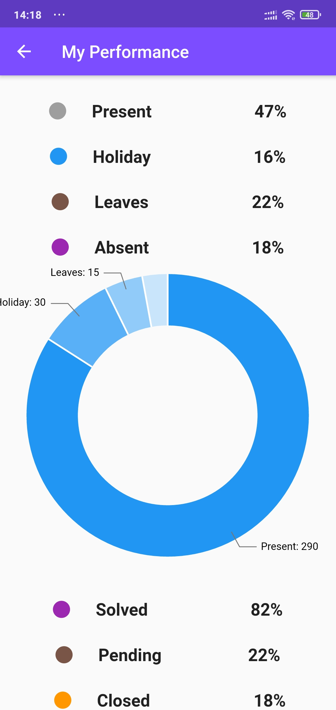

# new_cop

A new Flutter project.

## Getting Started

This project is a starting point for a Flutter application.
<table>
  <tr>
    <td>First Screen Page</td>
     <td>Holiday Mention</td>
     <td>Present day in purple and selected day in pink</td>
        <td>First Screen Page</td>
  </tr>
  <tr>
    <td></td>
    <td></td>
    <td></td>
     <td></td>

  </tr>
    <tr>
    <td>First Screen Page</td>
     <td>Holiday Mention</td>
     <td>Present day in purple and selected day in pink</td>
        <td>First Screen Page</td>

  </tr>
  <tr>
    <td></td>
    <td></td>
    <td></td>
     <td></td>

  </tr>
    <tr>
    <td>First Screen Page</td>
     <td>Holiday Mention</td>
     <td>Present day in purple and selected day in pink</td>
        <td>First Screen Page</td>

  </tr>
  <tr>
    <td></td>
    <td></td>
    <td></td>
     <td></td>

  </tr>
    <tr>
    <td>First Screen Page</td>
     <td>Holiday Mention</td>
     <td>Present day in purple and selected day in pink</td>
        <td>First Screen Page</td>

  </tr>
  <tr>
    <td></td>
    <td></td>
    <td></td>
     <td></td>

  </tr>
    <tr>
    <td>First Screen Page</td>
     <td>Holiday Mention</td>
     <td>Present day in purple and selected day in pink</td>
        <td>First Screen Page</td>

  </tr>
  <tr>
    <td></td>
    <td></td>
    <td></td>
     <td></td>
  </tr>
    <tr>
    <td>First Screen Page</td>
     <td>Holiday Mention</td>
           <td>Present day in purple and selected day in pink</td>
        <td>First Screen Page</td>

  </tr>
  <tr>
    <td></td>
    <td></td>
        <td></td>
     <td></td>

  </tr>
      <tr>
    <td>First Screen Page</td>
     <td>Holiday Mention</td>
           <td>Present day in purple and selected day in pink</td>
        <td>First Screen Page</td>

  </tr>
  <tr>
    <td></td>
    <td></td>
        <td></td>
     <td></td>

  </tr>
      <tr>
    <td>First Screen Page</td>
     <td>Holiday Mention</td>
           <td>Present day in purple and selected day in pink</td>
        <td>First Screen Page</td>

  </tr>
  <tr>
    <td></td>
    <td></td>
        <td></td>
     <td></td>

  </tr>
 </table>
        

A few resources to get you started if this is your first Flutter project:

- [Lab: Write your first Flutter app](https://flutter.dev/docs/get-started/codelab)
- [Cookbook: Useful Flutter samples](https://flutter.dev/docs/cookbook)

For help getting started with Flutter, view our
[online documentation](https://flutter.dev/docs), which offers tutorials,
samples, guidance on mobile development, and a full API reference.
